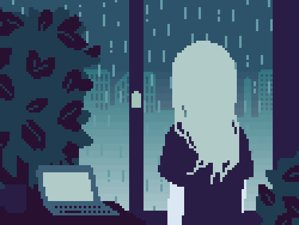

<h1 style="color: #f1f3f9; text-align: center; padding: 0px 20px; font-weight: 600">Hello, 
I`am Freelancer Software Developer who focuses in 
Web Development and curently learning about Crypto and Blockchain development at 
<a href="https://akademicrypto.com">Akademi Crypto</a>
</h1>

    
    <h5 style="color: #ffff; font-size: 26px; font-weight: 500">Misakura Rin</h5>

 

